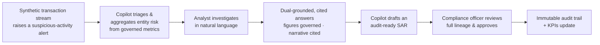

# SentinelAML Copilot — Product Overview

> An AML (Anti-Money-Laundering) suspicious-activity investigation and audit-ready reporting copilot
> for banks and NBFCs, built natively on the **Snowflake AI Data Cloud** and developed with the
> **Snowflake CoCo CLI** workflow. It lets an analyst investigate a flagged entity in natural
> language, get answers where **every number is governed and every claim is cited**, draft an
> audit-ready Suspicious Activity Report (SAR), and route it through a human approval gate — with the
> entire chain captured as an immutable, replayable audit trail.
>
> Built for the Snowflake CoCo CLI Hackathon 2026 (GCC Edition): **Challenge 1 (Risk, Fraud &
> Regulatory Intelligence Copilot)**, fused with the governed-semantic-layer discipline of
> **Challenge 5**.

---

## 1. The problem

Banking and NBFC risk, fraud, and compliance teams run AML investigations across fragmented systems
and largely manual steps: pulling transaction history, aggregating an entity's risk, cross-referencing
regulatory policy, writing up a SAR, and assembling evidence for audit. Two things make this slow and
risky:

- **Numbers aren't trustworthy by default.** The same question ("what's this entity's 90-day
  exposure?") can produce different answers depending on who runs it and how, because metric
  definitions live in people's heads and spreadsheets rather than in one governed place.
- **AI copilots make it worse, not better, if they hallucinate.** A generic LLM chatbot will happily
  invent a regulatory figure or an unsupported conclusion — which is unacceptable in a context where
  an output may end up in front of a regulator.

The result: long investigation times, inconsistent figures across departments, and AI outputs that
can't be defended in an audit.

## 2. The core idea — what makes this not just another chatbot

A regulatory answer is only *audit-ready* if the numbers are **governed** and the narrative is
**grounded in cited evidence**. SentinelAML Copilot enforces a strict, structural separation:

- **Deterministic figures** come only from **governed semantic views** with versioned metric
  definitions. They are reproducible and identical for every user. **The LLM never computes a
  regulatory figure** — it is only given numbers that Snowflake already computed.
- **Generative narrative** (explanations, SAR drafts) is produced by **Snowflake Cortex** and is only
  surfaced when **dual-grounded**: every numeric claim traces to a governed metric + query lineage,
  and every textual claim traces to a cited policy/evidence passage. Ungrounded output is refused or
  flagged — never presented as fact.
- The full chain — **question → semantic metric → generated query → source rows → calculation → AI
  narrative → human approval → outcome** — is captured as an **immutable, replayable audit record**.

That separation is the product. It's what turns "an AI that talks about risk" into "an AI whose every
assertion you can click, trace, and defend."

## 3. The golden-path journey

1. A synthetic transaction stream raises a suspicious-activity signal (e.g. structuring/smurfing).
2. The copilot creates a case and aggregates the entity's risk from governed metrics.
3. An analyst asks questions in plain English; the system shows how it interpreted the question, then
   answers with governed figures and cited evidence.
4. The analyst requests a SAR; the copilot drafts one where every figure links to a metric version +
   lineage and every assertion links to a policy passage.
5. A compliance officer reviews the full lineage and groundedness score, then approves or rejects.
6. The decision and its entire evidence chain are written to an immutable audit trail, and KPIs update.

## 4. Who it's for, and the journey it helps companies through

**Primary users**
- **Fraud / AML analyst** — investigates alerts, needs to prioritise cases and build a defensible
  narrative quickly.
- **Compliance officer** — reviews and approves SARs, is accountable for what gets filed.
- **Auditor** — needs to reconstruct exactly how any decision was reached.
- **Risk/operations leadership** — needs consistent figures and measurable throughput.

**Before SentinelAML Copilot**
- Investigations span many tools and manual steps; building one case takes hours.
- Different teams compute the same risk figure differently, so answers disagree.
- SAR narratives are hand-written and evidence is assembled after the fact.
- Any AI assistance is a black box — figures can't be traced, so they can't be trusted or filed.

**With SentinelAML Copilot**
- One investigation workspace: ask in natural language, get a cited answer in seconds.
- Every figure comes from a single governed definition — **the same question yields the same number
  for everyone**, provably (two roles see identical value + lineage).
- SAR drafts are generated with full traceability and clearly labelled as AI-generated decision
  support that still requires human review — never auto-filed.
- Nothing material happens without a human approval gate, and every step is captured immutably for
  audit.

### Concrete company outcomes

- **Faster, defensible investigations.** Natural-language investigation with pre-cited evidence
  collapses the manual gather-and-cross-reference work.
- **Consistency across departments.** Governed, versioned metrics end the "same question, different
  answer" problem.
- **Audit-ready by construction.** The full lineage is reconstructable from audit records alone;
  attempts to tamper with a record are themselves rejected and audited.
- **Safe AI adoption.** Dual-grounding + refusal logic means the copilot declines rather than
  fabricates — so it can be trusted in a regulatory setting.
- **Governed autonomy.** Deterministic rules and policy checks run before/around AI; a risk *signal*
  never auto-becomes a confirmed risk *event* without a human.

## 5. Scope at a glance

| | |
|---|---|
| **MVP (one complete high-value workflow)** | Synthetic transaction + alert + policy ingestion into Snowflake; governed semantic metrics; alert triage & risk aggregation; NL investigation with dual-grounded cited answers; refusal of unsupported requests; audit-ready SAR draft with lineage; human approval; immutable audit trail; KPI/observability panel; evaluation harness; scripted demo including failure scenarios. |
| **Stretch** | Second-domain "re-skin" of the same fabric; feedback-driven threshold tuning; richer entity resolution. |
| **Explicitly out of scope** | Real customer/production data; live regulator filing; connecting to real core-banking systems; multi-region deployment; production SLA guarantees. SAR "filing" is simulated only, after human approval. |
| **Responsible-data constraint** | All data is **fully synthetic** — no real customer, account, or transaction data appears anywhere (repo, prompts, logs, screenshots, demo, or generated reports). |

## 6. Key principles

- **Governed figures are the source of truth** — the LLM is structurally prevented from inventing or
  altering a regulatory number.
- **Dual-grounding gate** — an answer is only actionable when numeric claims cite a governed metric +
  lineage AND textual claims cite an evidence passage, at or above a groundedness threshold.
- **Human authority over material action** — no AI output becomes an action without passing an
  approval gate.
- **Immutable, replayable audit trail** — every step is an append-only record; a case's full lineage
  is reconstructable from records alone.
- **Graceful degradation** — Cortex/data failures fail safe (no actionable, ungrounded output) and
  route to human review.
- **Snowflake-native, config-only** — all connection settings come from configuration; no credentials
  in source, prompts, or logs; startup fails loudly if a required setting is missing.

## 7. How it maps to the hackathon rubric

| Rubric category | Weight | How the product addresses it |
|---|---|---|
| **Technical Execution** | 40% | Snowflake-native (streams/tasks, semantic views, Cortex, masking/row-access policies) built via CoCo CLI; property-based tests on correctness invariants |
| **Real-World Relevance** | 30% | A credible, high-stakes AML/SAR enterprise workflow for banks and NBFCs with measurable throughput and consistency gains |
| **Solution Completeness** | 30% | End-to-end golden path (ingest → triage → investigate → SAR → approval → audit → KPIs) plus five non-happy-path scenarios, evaluation harness, and scripted demo |

> **Every figure governed. Every claim cited. Every decision auditable.**
